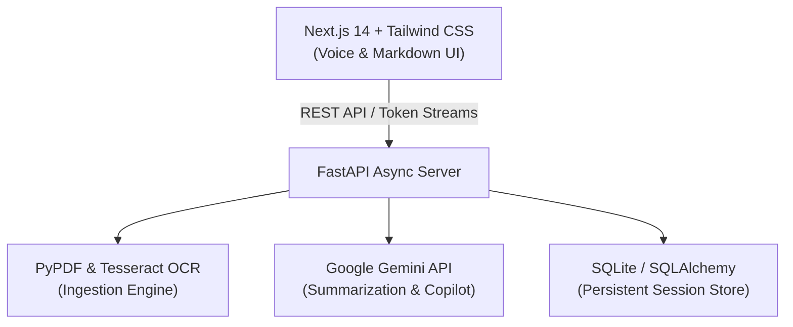

# DocuIQ — Intelligent Multimodal Document Assistant

DocuIQ is an end-to-end full-stack AI platform engineered to ingest complex documents (PDFs, scans, receipts), extract textual and visual content via OCR, stream multi-level summaries in real time, and support grounded conversational voice Q&A.

---

## 1. Project Deliverables

- **Live Application URL**: [https://frontend-pink-xi-64.vercel.app](https://frontend-pink-xi-64.vercel.app)
- **Backend API Documentation (Swagger)**: [https://docuiq-backend.onrender.com/docs](https://docuiq-backend.onrender.com/docs)
- **Source Code Repository**: [https://github.com/adithichiripal/DocuIQ](https://github.com/adithichiripal/DocuIQ)

---

## 2. Approach & Technical Architecture

DocuIQ is built as a decoupled, cloud-native monorepo separating a high-performance FastAPI backend from a Next.js frontend:

- **Dual Ingestion & OCR**: Native digital text is parsed via PyMuPDF (`fitz`), while scanned imagery and flattened pages fall back to Tesseract OCR with OpenCV image preprocessing.
- **Real-Time Streaming Intelligence**: Powered by Google Gemini via chunked streaming HTTP responses, delivering multi-granularity (Quick, Detailed, Action Items) and multi-lingual summaries with low perceived latency.
- **Strictly Grounded Voice Copilot**: Context-aware Q&A constrained strictly to extracted text to prevent hallucinations, enhanced with the Web Speech API and client-side Text-to-Speech (TTS).
- **State Persistence & Cloud Hosting**: Document metadata, OCR results, and chat history persist in an SQLite/SQLAlchemy layer. The backend is containerized with Docker on Render, while the frontend is deployed to Vercel's Edge network.

---

## 3. System Architecture

## 3. System Architecture



## 4. Tech Stack

- **Frontend**: Next.js 14/15 (App Router), React, Tailwind CSS, Lucide Icons, Web Speech API
- **Backend**: FastAPI, Uvicorn, PyMuPDF, Pytesseract, SQLite, SQLAlchemy, Docker
- **AI Model**: Google Gemini Pro SDK
- **Cloud Infrastructure**: Vercel (Frontend), Render (Containerized Backend)

---

## 5. Local Setup & Execution

### Backend Setup

```bash
cd backend
python -m venv venv
# Windows:
.\venv\Scripts\activate
# Linux/macOS:
source venv/bin/activate

pip install -r requirements.txt
uvicorn main:app --reload --port 8000
```

### Frontend Setup

```bash
cd frontend
npm install
npm run dev
```
